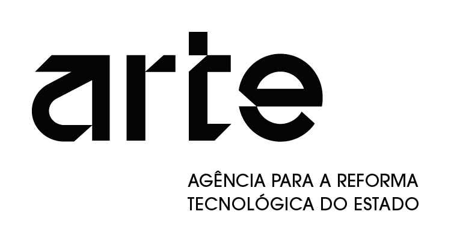

# Catálogo Nacional de Modelos de Dados para os Territórios Inteligentes

  

  
  
  

O **Catálogo Nacional de Modelos de Dados (CNMD) para os [Territórios Inteligentes](https://territoriosinteligentes.gov.pt)** é um instrumentos fundamental para promover a interoperabilidade, harmonização e qualidade dos dados disponibilizados pelas entidades públicas. Organiza e documenta modelos de dados normalizados, garantindo uma referência comum para a publicação, partilha e reutilização de informação a nível nacional.

Este catálogo foi desenvolvido para apoiar as entidades na **adoção de práticas consistentes**, assegurando que os dados publicados seguem padrões uniformes, tanto ao nível estrutural como semântico. Ao fazê-lo, contribui para a melhoria dos serviços digitais, para a eficiência operacional e para uma maior transparência na disponibilização de informação.

## Organização

O CNMD está organizado por áreas temáticas e, para cada tema existe:

- um ficheiro `README.md`, que descreve o modelos (ou modelos) usado na área temática;
- uma directoria `exemplos` que contém um ou mais exemplos de uso do(s) modelo(s);
- uma directoria `schema` que contém os JSON Schemas que permitem validar o(s) modelo(s). 

## FAQs

A área de **[FAQ](FAQ.md)** do Catálogo Nacional de Modelos de Dados para os Territórios Inteligentes foi criada para apoiar as entidades e utilizadores na correta adequação dos dados que pretendem disponibilizar aos modelos publicados neste catálogo. Aqui encontrará esclarecimentos práticos sobre conceitos, regras e procedimentos que garantem uma aplicação consistente, interoperável e alinhada com as orientações definidas.

O Catálogo Nacional de Modelos de Dados é um instrumento em **evolução contínua**, em permanente melhoria e expansão. Por esse motivo, também as perguntas frequentes são atualizadas de forma dinâmica, acompanhando a maturidade do catálogo, as necessidades das entidades e os desafios que surgem na adoção dos modelos.
